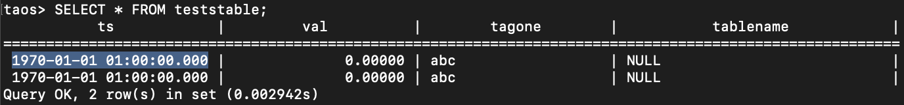

# tdengine-problems

## Deployment
* Check if everything can be templated
```bash
helmfile -f helmfile.yaml template
```
* Aplpy it
```bash
helmfile -f helmfile.yaml apply
```
* Sync if any changes occur
```bash
helmfile -f helmfile.yaml sync
```
* Destroy afterwards
```bash
helmfile -f helmfile.yaml destroy
```

## Access
* Port forward AKHQ for inspecting
```bash
k port-forward svc/akhq 8080:80
```
* Open `http://127.0.0.1:8080/ui/cluster/topic/test/data` in the browser
* Connect to DB
```bash
k exec -it po/tdengine-0 -c tdengine -- taos
```
* SQL commands to check DB (Use the `SELECT` statement when you expect data to be transferred into the DB)
```SQL
USE test;

SHOW STABLES;
SHOW TABLES;

SELECT * FROM teststable;
```

* In AKHQ which we opened in the browser we can `Produce to topic` (bottom right) where the `Value` should be our `InfluxDB line protocol` record
* Record: `teststable,tablename=testme,tagone=abc val=0f32 1680683740100`
  * This record produces `1970-01-01 01:00:00.000`
* Record: `teststable,tablename=testme2,tagone=abc val=0f32 1680337051000400200`
  * This record produces `1970-01-01 01:00:00.000`
* Record: `teststable,tablename=testme3,tagone=abc val=0f32 16803370510004002000`
  * This record produces `java.sql.SQLException: TDengine ERROR (80000127): invalid timestamp:16803370510004002000`

* After the insertion


## More resources
* Check KafkaConnect availability
```bash
k get kafkaconnect
```
* Check KafkaConnector availability (runs inside the KafkaConnect resource)
```bash
k get kafkaconnector
```
